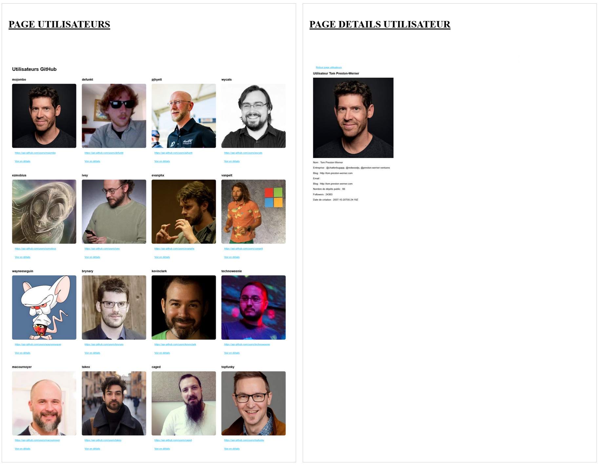

# Atelier 4.1 : ES2015

## Enoncé

1. Récupérez les [ressources de l'atelier 4.1](./resources/4.1.zip)

2. Refactorisez la ressource ***index.js*** en utilisant *let*, *const*, paramètre par défaut, la décomposition, les raccourcis d'objets littéraux, etc.

3. Fusionnez les 2 objets de la ressource ***config.js*** dans une nouvelle variable `finalSettings`, la configuration de l'utilisateur écrase les valeurs par défauts.

4. Extrayez la propriété `theme` de `finalSettings` dans une variable tout en regroupant l'ensemble des autres propriétés dans un objet `otherSettings`.

5. Ecrivez une fonction dont la signature est  `sumAndMultiply(factor, ...numbers)`.
Cette fonction multiplie chaque nombre du tableau `numbers` par `factor` et retourne la somme total.

6. Créez une classe `Notification` avec :
- Un constructeur prenant `message` et `timestamp` (valeur par défaut : la date du jour `new Date()`).
- Une méthode `send()` qui affiche `"[NOTIFICATION] (date) : message"`.

7. Créez une classe fille `EmailNotification` qui hérite de `Notification` dont les caractéristiques sont :
- Son constructeur prend `recipient`, `message` et `timestamp`
- Redéfinition la méthode `send()` pour afficher `"[EMAIL -> recipient] (date) : message"`.
- Un champ privé `#apiKey`, tester que ce champ privé n'est pas accessible depuis l'extérieur de l'instance.

8. Transformez la ressource ***api.js*** en module pour pouvoir l'utiliser en dehors du fichier.

9. Créez un nouveau fichier ***main.js***, utilisez la fonction ***fetchUserData()*** du fichier *api.js*

10. Ecrivez une nouvelle fonction ***findUsers()*** dans *api.js* qui récupère les utilisateurs GitHub et retourne uniquement une collection avec l'identifiant, le login et l'url
```javascript
const users = findUsers('https://api.github.com/users'); 
// Résultat attendu
// [
//  { id: 1, login: 'abc', url: 'https://...'},
//  { id: 1, login: 'xyz', url: 'https://...'},
// ...
// ]
```

11. Utilisez cette fonction dans ***main.js***

---

## Bonus

12. Construisez l'interface graphique ci-dessous à partir des ressources présentes dans ***views***.
L'objectif est de récupérer les informations depuis l'API de GitHub, pour chaque utilisateur d'hydrater le template user.html et reinjecter l'ensemble dans index.html. Le tout sans modifier les fichiers HTML.

